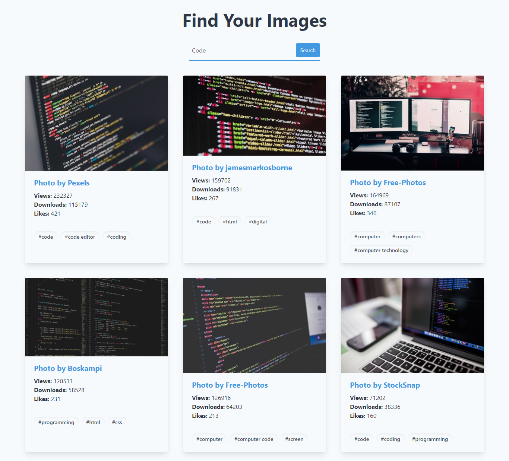

# Image Gallery

## To run this app in your machine

1. Clone this repository  
   `git clone git@github.com:hendraaagil/pizza-joint.git`
2. Install all dependencies  
   `npm install`
3. Copy `env.example` to `.env` and change with your own Pixabay API Key
4. Run app  
   `npm start`

Happy Coding!
